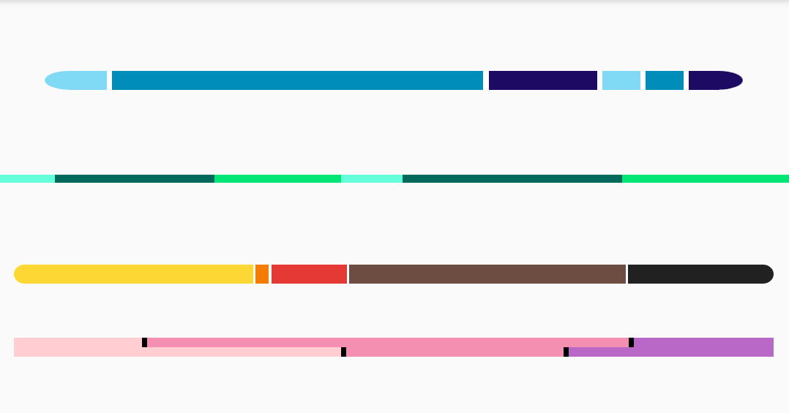

# ProportionsBarLibrary

An easy way to visualize in proportions any of your data.



## Latest Version
[](https://jitpack.io/#maxViolet/ProportionsBarLibrary)

## How to use
### Add this to **top** level `build.gradle`:
```groovy
 allprojects {
        repositories {
            maven { url "https://jitpack.io" }
        }
    }
```

### Configuring your project dependencies
```groovy
dependencies {
    implementation 'com.github.maxViolet:ProportionsBarLibrary:0.1.1'
}
```

### Creating the view via code
```java
ProportionsBar proportionsBar = new ProportionsBar(context);
proportionsBar.setId(R.id.proportions_bar_1);
```

### Adding the view to container view (LinearLayout in this case)
```java
LinearLayout container = findViewById(R.id.container_pb);
container.addView(proportionsBar);
```

### Adding values (accepts any Number.class)
```java
proportionsBar.addValues(11, 30.0, 24.21, -12.1, 41, 27.999);
```

### Adding colors
*Where are can be less colors than number of values
```java
proportionsBar.addColors(getResources().getColor(R.color.example1), getResources().getColor(R.color.example2),getResources().getColor(R.color.example3));
proportionsBar.addColors("#81DAF5", "#008db9", "#1c0a63")
```

### Styling the view
Disable gaps (default value = true)
```java
proportionsBar.showGaps(false);
```
Change the gaps' size (default is 1.0 in percent of view's width)
```java
proportionsBar.gapSize(0.8);
```
Change the gaps' color (default is white)
```java
proportionsBar.gapColor(Color.BLACK)
proportionsBar.gapColor("#ffffff");
```
Show rounded corners (default value = false)
```java
proportionsBar.showRoundedCorners(true);
```
Change radius of the rounded corners (default value is 1.4)
```java
proportionsBar.radiusRoundedCorners(3.5);
```
